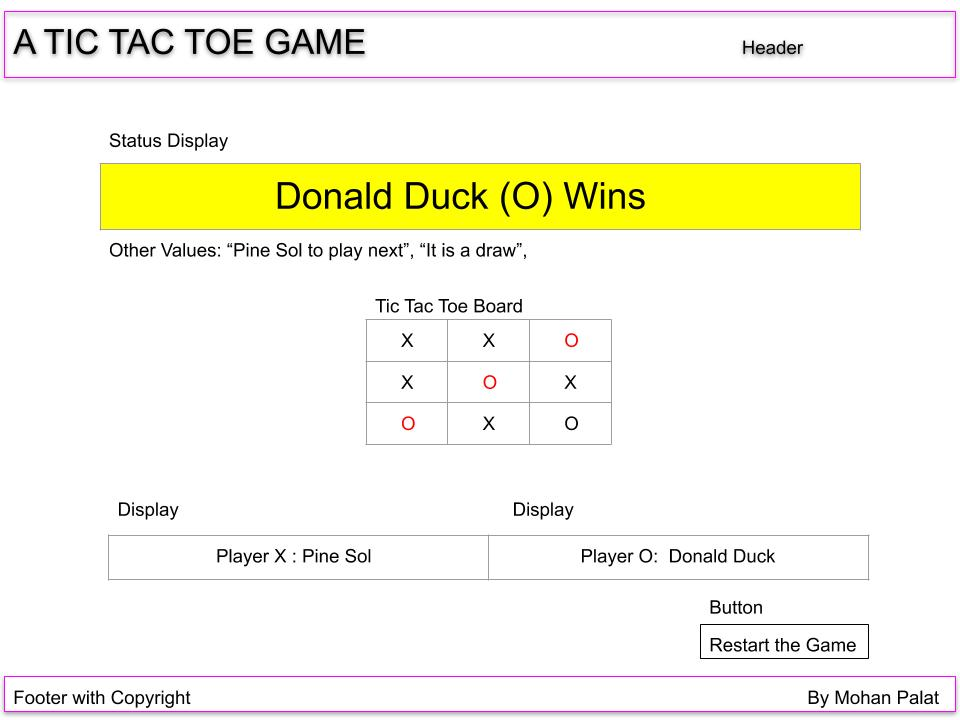

# Project 1. Tic Tac Toe

## 1. Technologies used 

HTML, CSS and JavaScript

## 2. Learning experiance / Approach
* Flex Box / Grid
* Object inside another object - Array inside Array, Function inside function and Anonymous functions
* Array Functions - In the following code snippet, we are checking a possible winning combination for player O - If there are two Os and no Xs in a game row on the board, we know O can win. Array function filter makes the implementation simple and elegany 
```JavaScript
        if ( currentBoardMapped[i].filter(isX => isX === 'x').length === 0 &&
             currentBoardMapped[i].filter(isO => isO === 'o').length === 2
           )
```

## 3. Design Components - Wireframe, Pseudocode

### 3.1 Wireframe


### 3.2 Pseudocode
a. Start up 
   {
     The following will be presented on the UI {
     An empty board, Status/Action Box and Reset button will be 
     User can click on the Status/Action to choose an AI Opponent
     Prompt on Status/Action will be "X to play"
     Switch game alive to "on"
   }

b. Once player clicks on the board cells to play 
   {
     If the game is not alive (dies when someone has won or lost or tied)
       Do nothing (Player has to reset to continue)
     Add class x to the correponding Div defenition in the HTML
     Check Game Status
       A. Is there a winner
       {
         If yes, 
           Add class "won" to the 3 winning div elements in HTML
           This will change the winning combo on the board to red
           Switch the game alive to "off"
       }
       B. Is the game tied
       { 
         Happens when the following two conditions are true 
           1. There are no empty cells on the board
           2. There is no winner or looser yet
         If yes, Switch the game alive to "off" and do nothing else
         At this point the player has to click "Reset" to get a new game
       }
       C. If (A) and (B) did not happen, the game needs to continue
       {
         Switch the user (X to O / O to X)
         If O is an AI Player follow the step (c)
       } 
       D. Otherwise
       { 
         Display prompt "O is next" and wait for the user
         Repeat step (b) for player O
       }

c. AI Play       
  The AI plays based on the following four conditions
  If board has a potential winning combination for self [o][o][undefined]
  {
    Mark that game cell to make it [o][o][o]  
  } else If board has a potential winning combination for opponent [x][x][undefined] {
    Sabotage oponent by marking the row thusly - [x][x][x]  
  } else if middle of the board (Cell 4) is available
  {
    Mark Cell 4 with o  
  } else
  {
    Mark the earliest available empty game cell
  }

d. After every play the step (b) is executed to check current job status

e. Player clicked "Reset" Button
   {
      Clear the classes o, x and won
      Do the steps from (a)
   }

f. Background Music
   if the player clicks on a game cell on the board music begins to play
   During the play, if the player wants quite, she or he can click on the status display to pause the player 


### Grid 1. Current Board Content (O has won)
  | COL1 | COL2 | COL3 |
  |:-----:|:-----:|:-----:|
  |  X  |  `O`  |  X  |
  |  X  |  `O`  |     |       
  |     |  `O`  |     |      

### Grid 2. Current board Layout
  | COL1 | COL2 | COL3 |
  |:-----:|:-----:|:-----:|
  |  0  |  1  |  2  |
  |  3  |  4  |  5  |
  |  6  |  7  |  8  |        

### Grid 3. Mapped Current Board (O has won)
  | COL1 | COL2 | COL3 |   
  |:-----:|:-----:|:-----:|
  |  X  |  O  |  X  |      
  |  X  |  O  |     |      
  |     |  O  |     |      
  |  X  |  X  |     |
  |  `O`  |  `O`  |  `O`  |      
  |     |     |     |      
  |  X  |  O  |     |      
  |  X  |  O  |     |    

### Grid 4. Winning Combinations 
  | COL1 | COL2 | COL3|    
  |:-----:|:-----:|:-----:|
  |  0  |  1  |  2  |      
  |  3  |  4  |  5  |      
  |  6  |  7  |  8  |      
  |  0  |  3  |  6  |      
  |  1  |  4  |  7  |      
  |  2  |  5  |  8  |      
  |  0  |  4  |  8  |      
  |  2  |  4  |  6  |      

```html
    <div class="game-grid">
        <div class="game-cell pos-tl x"></div>
        <div class="game-cell pos-tm o won"></div>
        <div class="game-cell pos-tr x"></div>
        <div class="game-cell pos-ml x"></div>
        <div class="game-cell pos-mm o won"></div>
        <div class="game-cell pos-mr"></div>
        <div class="game-cell pos-bl"></div>
        <div class="game-cell pos-bm o won"></div>
        <div class="game-cell pos-br"></div>
    </div>
```


